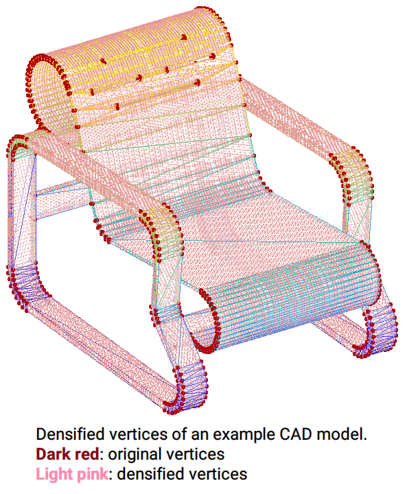

## Learning Efficient Point Cloud Generation for Dense 3D Object Reconstruction
Chen-Hsuan Lin, Chen Kong, and Simon Lucey  
AAAI Conference on Artificial Intelligence (AAAI), 2018  

Website: https://chenhsuanlin.bitbucket.io/3D-point-cloud-generation  
Paper: https://chenhsuanlin.bitbucket.io/3D-point-cloud-generation/paper.pdf  
arXiv preprint: https://arxiv.org/abs/1706.07036

We provide TensorFlow code for the single-category experiment (for [ShapeNet](https://www.shapenet.org/) chairs).

--------------------------------------

## Training/evaluating the network

### Prerequisites  
This code is developed with Python3 (`python3`). TensorFlow r1.0+ is required. The dependencies can install by running
```
pip3 install --upgrade numpy scipy termcolor tensorflow-gpu
```
If you don't have sudo access, add the `--user` flag.  

### Dataset  
The dataset (8.8GB) can be downloaded by running the command
```
wget https://cmu.box.com/shared/static/s4lkm5ej7sh4px72vesr17b1gxam4hgy.gz
```
This file includes:
- Train/test split files (from [Perspective Transformer Nets](https://github.com/xcyan/nips16_PTN))
- Input RGB images (from [Perspective Transformer Nets](https://github.com/xcyan/nips16_PTN))
- Pre-rendered depth images for training
- Ground-truth point clouds of the test split (densified to 100K points)

After downloading, run `tar -zxf s4lkm5ej7sh4px72vesr17b1gxam4hgy.gz` under the main directory. The files will be extracted to the `data` directory.  
(Please also cite the relevant papers if you plan to use this dataset package.)

### Running the code  
The following scripts gives examples for running the code.
- Pretraining the network: `scripts/run-pretrain.sh`  
- Fine-tuning with joint 2D optimization: `scripts/run-finetune.sh`  
- Evaluating on the test set: `scripts/run-evaluate.sh`  
- Computing the error metrics: `scripts/run-compute-error.sh`  

Checkpoints are stored in `models_${GROUP}`, summaries are stored in `summary_${GROUP}`, and evaluated point clouds are stored in `results_${GROUP}`.  
The list of optional arguments can be found by executing `python3 train.py --help`. The default training settings in this released code is slightly different from the paper but optimizes the networks better.  
We provide two different network architectures: (1) originally from the paper (2) deeper with residual blocks. Reference performances on the test set is as follows (note that different runs will result in slightly different performances):

|          | pred→GT | GT→pred |
|:--------:|:-------:|:-------:|
| original |  1.7342 |  1.8371 |
|  ResNet  |  1.6723 |  1.8169 |

--------------------------------------

## Rendering ground-truth depth images
We provide the code to render depth images for supervision.  

### Prerequisites  
This code requires the following:
- [Blender](https://www.blender.org/) as the rendering engine. This code was developed with Blender 2.78.  
  After installation, please make sure the command `blender` is callable (use `which blender` to check installation).
- The [OpenEXR Python binding](http://www.excamera.com/sphinx/articles-openexr.html) for .exr to .mat file conversion.  

### Dataset  
The raw ShapeNet dataset can be downloaded [here](https://www.shapenet.org/).  
This rendering code was developed to use ShapeNetCore v2. (The provided depth images were rendered from ShapeNetCore v1.)

### Running the code  
Under `render`, run `./run.sh 03001627 8` to render depth images for fixed and arbitrary viewpoints, and convert them to .mat files. This will convert all objects in the ShapeNet chair category (03001627) with 8 fixed viewpoints.  
The rendered files will be stored in the `output` directory.

--------------------------------------

## Creating densified point clouds of CAD models for evaluation
We also provide the code to densify the vertices of CAD models to a specified number. This code can be run independently; only the ShapeNet dataset is required.
It repeats the process of adding a vertex to the center of the longest edge of the triangular mesh and subsequently re-triangulating the mesh. This will create (generally) uniformly densified CAD models.  
<p align="center"></p>

### Running the code  
Under `densify`, run `./run.sh 03001627` to run densification. The densified CAD models will be stored in the `output` directory.

--------------------------------------

If you find our code useful for your research, please cite
```
@inproceedings{lin2018learning,
  title={Learning Efficient Point Cloud Generation for Dense 3D Object Reconstruction},
  author={Lin, Chen-Hsuan and Kong, Chen and Lucey, Simon},
  booktitle={AAAI Conference on Artificial Intelligence ({AAAI})},
  year={2018}
}
```

Please contact me (chlin@cmu.edu) if you have any questions!


